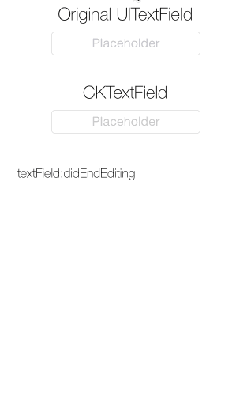

CKTextField
===========

Enhanced `UITextField`, for improved visuals with centered placeholder.

Have you ever built a UI with a `UITextField` that has a placeholder text and a `NSTextAlignmentCenter`? Give it a try (or look at the demo provided in this repo)! You will notice that the cursor behaves weird and is placed at the beginning of the placeholder text. The `CKTextField` fixes that behaviour at the cost of sacrificing the text field's left view. It also adds a nice, subtle animation to the placeholder text when it appears and disappears. And it let's you still register as `UITextFieldDelegate`.

_CKTextField does this by using 100% public API!_

Of course you can also use CKTextField with left or right text alignment to have the subtle placeholder animation.

## Usage

Add CKTextField to your project by copying the .h and .m files, or use CocoaPods.

Simply set the UITextField's class property in the Interface Builder to CKTextField and you're done. All other layout information is taken from the settings you made in Interface Builder.

## Author

Christian Klaproth, [@JaNd3r](http://twitter.com/JaNd3r)

## License

CKTextField is available under the MIT license. See the LICENSE file for more info.
