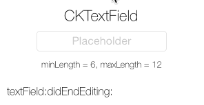

CKTextField
===========

Enhanced `UITextField`, with improved visuals for a sweet UX.

Add input validation to your text fields. Give the user visual feedback of the validation result! Validation failed? Shake the text field! Validation passed? Show an accept button which allows to end editing and hide the keyboard!

`CKTextField` also fixes the cursor misplacement of the original `UITextField` when using a placeholder in combination with centered alignment. 

_CKTextField does this by using 100% public API!_

## Usage

Add CKTextField to your project by copying the .h and .m files, or use CocoaPods.

Simply set the UITextField's class property in the Interface Builder to CKTextField and you're done. All other layout information is taken from the settings you made in Interface Builder.

## Author

Christian Klaproth, [@JaNd3r](http://twitter.com/JaNd3r)

## License

CKTextField is available under the MIT license. See the LICENSE file for more info.
